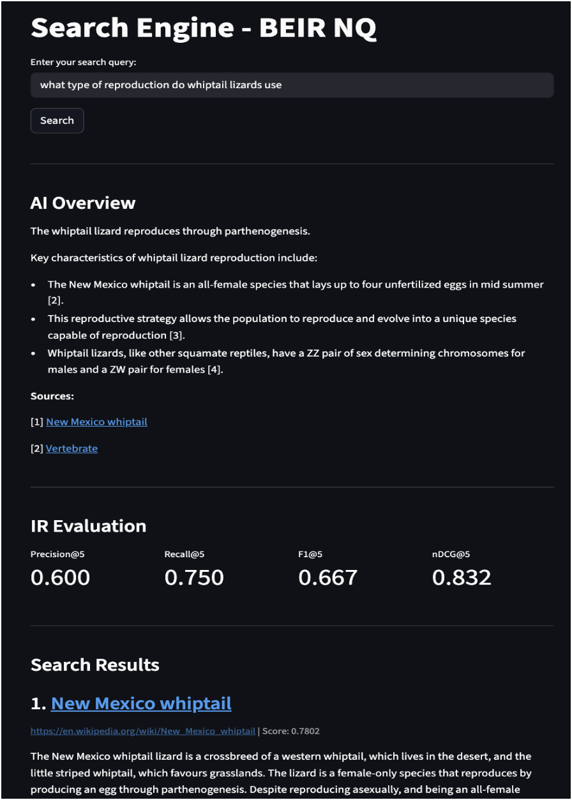
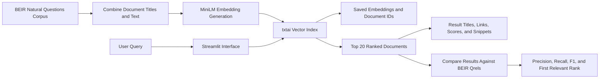

# Honors Thesis: Comparing Information Retrieval in AI-Powered and Traditional Search Systems

A research-driven semantic search engine built to evaluate how modern AI-powered retrieval compares with traditional information retrieval systems.

This project was developed as part of the honors thesis **“Comparing Information Retrieval in AI-Powered and Traditional Search Systems”** by Shahab Kiyani and Sarang Kale.



## Overview

Search is shifting from retrieving ranked documents to generating direct answers.

Traditional search systems prioritize efficiency, predictable ranking, and source transparency. AI-enhanced systems offer stronger semantic understanding and faster synthesis, but introduce new concerns around reliability, explainability, and source attribution.

This repository contains the technical search-engine prototype used to explore those tradeoffs. It performs dense semantic retrieval over the **BEIR Natural Questions dataset**, displays ranked Wikipedia documents through an interactive Streamlit interface, and evaluates retrieval quality against benchmark relevance judgments.

## Research Question

> How do AI-powered retrieval systems compare with traditional information retrieval systems when evaluated on a shared dataset?

The broader thesis examined this question through two complementary perspectives:

* **Technical evaluation:** retrieval quality, ranking behavior, latency, and system transparency
* **User evaluation:** trust, usefulness, speed, and preferences between document lists and generated answers

## Features

* Semantic search across the BEIR Natural Questions corpus
* Dense vector embeddings generated with `all-MiniLM-L6-v2`
* Vector indexing and similarity search using `txtai`
* Interactive search interface built with Streamlit
* Ranked results with titles, snippets, similarity scores, and source links
* Query normalization for matching user input to official BEIR queries
* Benchmark evaluation using:

  * Precision@5
  * Recall@5
  * F1@5
  * First relevant document rank
* Persistent embedding storage to separate expensive offline indexing from online retrieval

## System Architecture



The system is divided into two stages:

1. **Offline indexing:** download the corpus, prepare documents, generate embeddings, and save the vector index.
2. **Online retrieval:** load the saved index, process user queries, return ranked documents, and calculate evaluation metrics.

This separation avoids regenerating embeddings whenever the application starts.

## Dataset

The project uses the **Natural Questions** dataset from the BEIR information retrieval benchmark.

The dataset contains:

* A corpus of more than 100,000 Wikipedia documents
* Natural-language questions based on real information-seeking behavior
* Relevance judgments, or `qrels`, mapping benchmark questions to relevant documents

Using a shared corpus and established relevance judgments makes it possible to evaluate retrieval performance objectively rather than relying only on subjective impressions.

## Technology

| Component             | Purpose                                           |
| --------------------- | ------------------------------------------------- |
| Python                | Core implementation                               |
| BEIR                  | Dataset loading and benchmark relevance judgments |
| Sentence Transformers | Dense query and document embeddings               |
| MiniLM                | Semantic embedding model                          |
| txtai                 | Vector indexing and similarity retrieval          |
| Streamlit             | Interactive search and evaluation interface       |
| Pickle                | Persistent document-ID mapping                    |

## Thesis Results

The final thesis evaluation reported the following average retrieval results:

| Metric    | Average |
| --------- | ------: |
| Precision |  0.8046 |
| Recall    |  0.7991 |
| F1 Score  |  0.7941 |
| nDCG      |  0.8460 |

These results demonstrated strong and relatively balanced retrieval quality, with relevant documents generally ranked near the top of the result set.

> **Note:** The current public application calculates Precision, Recall, and F1 at multiple cutoffs, along with first relevant rank. The reported nDCG value comes from the broader thesis evaluation and is not currently calculated inside `main2_streamlit.py`.

## Key Findings

The project found that traditional and AI-enhanced search should not necessarily be treated as direct replacements for one another.

* **Semantic retrieval improves conceptual matching.** It can retrieve relevant documents even when the query and document use different wording.
* **Semantic similarity does not always equal practical relevance.** A document may be conceptually related while still failing to answer the exact question.
* **Traditional retrieval offers stronger traceability.** Ranked documents allow users to inspect and compare the original sources directly.
* **Generative search reduces user effort but introduces new failure modes.** Generated responses may be unsupported, inconsistently cited, or difficult to trace back to their evidence.
* **Benchmark relevance and human usefulness are not identical.** A result can appear helpful to a user while receiving a poor benchmark score, or satisfy benchmark labels without feeling useful.
* **Hybrid search is a promising direction.** Combining lexical precision, semantic retrieval, and carefully grounded generation may provide a stronger balance of relevance, usability, and transparency.

## Getting Started

### 1. Clone the repository

```bash
git clone https://github.com/ShahabKiyani/ai-search-engine-evaluation.git
cd ai-search-engine-evaluation
```

### 2. Create and activate a virtual environment

macOS or Linux:

```bash
python3 -m venv venv
source venv/bin/activate
```

Windows:

```bash
python -m venv venv
venv\Scripts\activate
```

### 3. Install dependencies

```bash
pip install -r requirements.txt
```

### 4. Download the BEIR Natural Questions dataset

```bash
python download_data.py
```

The dataset will be downloaded and extracted into:

```text
datasets/nq
```

### 5. Build the semantic-search index

```bash
python build_nq_index.py
```

This process:

* Loads the BEIR corpus
* Combines each document's title and body
* Generates MiniLM embeddings
* Builds the `txtai` vector index
* Saves the embeddings to `nq_embeddings`
* Saves the document-ID mapping to `nq_doc_ids.pkl`

Index generation may take some time depending on the available hardware.

### 6. Run the application

```bash
streamlit run main2_streamlit.py
```

Streamlit will provide a local URL where the application can be opened in a browser.

## Evaluation Behavior

The application accepts any search query and returns the top 20 semantically related documents.

Formal evaluation metrics are displayed only when the normalized user query matches one of the official BEIR Natural Questions benchmark queries. Normalization removes differences in capitalization, punctuation, and extra spacing.

For unmatched queries, retrieval results remain available, but benchmark metrics cannot be calculated because no official relevance judgments exist for that input.

## Project Structure

```text
ai-search-engine-evaluation/
├── build_nq_index.py       # Generates and saves the semantic index
├── download_data.py        # Downloads the BEIR NQ dataset
├── main2_streamlit.py      # Streamlit search and evaluation interface
├── requirements.txt        # Python dependencies
├── datasets/               # Downloaded BEIR dataset
├── nq_embeddings/          # Generated txtai embedding index
└── nq_doc_ids.pkl          # Mapping from index positions to BEIR document IDs
```

## Current Limitations

* The public implementation uses one dense-retrieval model and one benchmark dataset.
* It does not currently include a BM25 lexical baseline in the interface.
* Benchmark metrics are available only for official BEIR queries.
* Relevance judgments do not always reflect human-perceived usefulness.
* Dense indexing requires significantly more preprocessing than basic lexical indexing.
* Wikipedia URLs are constructed from document titles rather than taken directly from dataset metadata.
* The public application currently focuses on retrieval and does not include the complete generative-answer workflow studied in the thesis.

## Future Work

Potential extensions include:

* Combining BM25 and dense embeddings in a hybrid retrieval pipeline
* Adding cross-encoder reranking
* Supporting additional BEIR datasets and domains
* Evaluating retrieval latency and resource consumption
* Restoring AI-generated summaries with stronger citation grounding
* Measuring hallucination and answer faithfulness
* Comparing multiple embedding and language models
* Developing evaluation frameworks designed specifically for generated search answers
* Expanding the user study with a larger and more diverse participant group

## Research Materials

* [Read Shahab's final thesis paper](docs/Thesis-Paper-Shahab.pdf)
* [Read Sarang's final thesis paper](docs/Thesis-Paper-Sarang.pdf)
* [View the honors thesis defense](docs/Thesis-Defense.pdf)

## Authors

**Shahab Kiyani**
Technical implementation, search-engine architecture, retrieval evaluation, and system analysis

**Sarang Kale**
User-perception research, survey design, and qualitative analysis

## Academic Context

Developed as an undergraduate honors thesis exploring the evolution of search from ranked document retrieval toward semantic and generative systems.

The project combines information retrieval theory, machine learning, software engineering, benchmark evaluation, and user-centered research to examine not simply whether AI search is “better,” but where each search architecture provides the most value.
